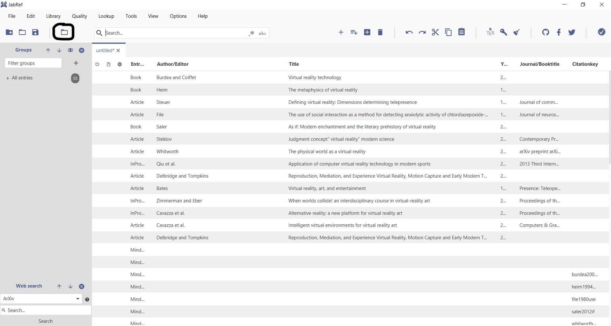
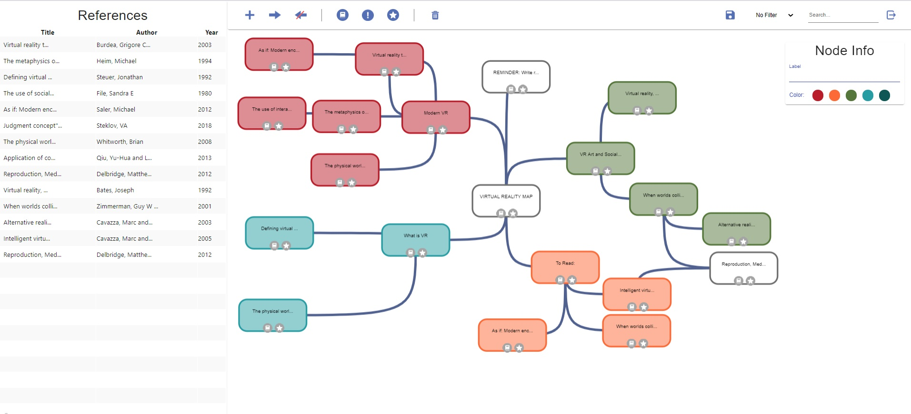

# JabMap: The JabRef MindMapping Tool

JabRef is an open-source reference management tool that allows users to collect and organize sources for literature.

JabMap is a MindMap extension for the Jabref tool that can be be used to visually organize data stored in JabRef.
This MindMap extension is especially useful for linking connected articles and categorizing sources.

JabMap implementation can be found in jabref>jabMap>mind-map

## JabMap Features

When references have been added to JabRef, the user can open the JabMap tool and see the sources in the reference table.
JabMap allows you to create label nodes and nodes containing a reference. Nodes in the MindMap can then be linked together
with edges, and individual nodes can have their colour changed, be marked as read or unread and be assigned a priority.

## Running JabMap Locally

To run JabMap you must first build and run JabRef from the source. This requires you to have JDK 13 or higher installed 
on your device.

Download the SE761Team4 jabref source code and open a terminal window at the jabref location. 

To set up the project, in the terminal window run:
gradlew assemble

To start JabRef, run the following in the terminal: 
gradlew run

(Alternatively, JabRef can be set up in intelliJ using these set up instructions: https://docs.jabref.org/installation)

The JabRef's GUI should now start up. 
To populate JabRef with dummy data references, select File>Import>Import into new library. Navigate to the jabref folder
and select map_test.bib.
JabRef should become populated with dummy data references.

To open the JabMap tool, click the open JabMap button circled above

You should see a MindMap like the one show below:

## How to use JabMap

### Creating Nodes

The References table corresponds to the references that have been loaded into JabRef. To create a new node for a reference,
you can drag and drop the reference from the table onto the map area. 

To create a label node , you can select an existing node of the MindMap and then click the '+' symbol in the tool bar. 

The label and colour of the node can be adjusted in the Node Info bar on the right.

### Deleting Nodes

To delete a node, select it and then click the delete icon in the tool bar.

### Linking Nodes

To link two nodes together, you can select the first node, click the link symbol in the tool bar and then click the second node. 

Unlinking nodes is a similar process: Select the first node, click the unlink button and then click the second node.

### Using Node Icons

Each node has three icons to represent the priority, read status, and the favourite status of the node.

To set a priority on a node, the priority symbol can be clicked to change colour. Alternatively, the priority can be changed
by selecting a node and using the priority icon in the tool bar.

To change the read status of a node, the read symbol on a node can be clicked, or the node can be selected and the read
symbol in the toolbar can be used.

To favourite a node, the star icon in the node can be clicked, or the star icon in the tool bar can be used instead.

### Saving the MindMap

The save icon in the toolbar can be used to save the whole MindMap.

### Sorting the MindMap

The filter dropdown and the search box to the right of the toolbar can be used to organise the MindMap.

